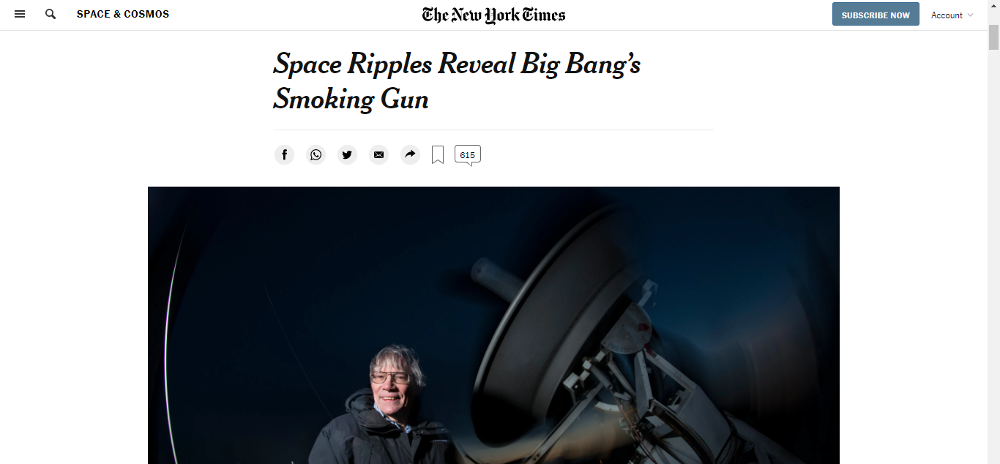

# NY-TIMES-ARTICLE-CLONE

> This project is a clone of the following NY Times article:  https://www.nytimes.com/2014/03/18/science/space/detection-of-waves-in-space-buttresses-landmark-theory-of-big-bang.html?_r=0 
> The goal was to master positioning and floating elements 

## Built With

- HTML, CSS
- Linters
- Fontawesome

## Live Demo

[Live Demo Link](https://livedemo.com)

## Getting Started

**To get a local copy of this project, simply click the green download button above and clone it, or simply download the zip file.*

## Authors

👤 **Author1**

- GitHub: [@felix-vondee](https://github.com/felix-vondee)
- Twitter: [@felix_vondee](https://twitter.com/felix_vondee)
- LinkedIn: [Felix Vondee](https://linkedin.com/felix-vondee)

## 🤝 Contributing

Contributions, issues, and feature requests are welcome!

Feel free to check the [issues page](issues/).

## Show your support

Give a ⭐️ if you like this project!

